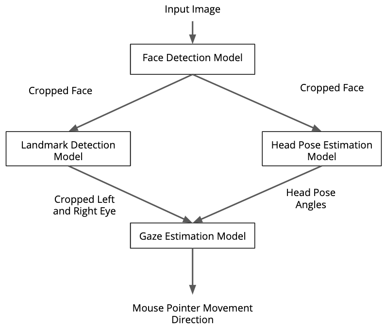

# Computer Pointer Controller

In this project, I am using a **Gaze Detection Model** to control the mouse pointer of our computer. I am using the Gaze Estimation model to estimate the gaze of the user's eyes and change the mouse pointer position accordingly. This project demonstrates the ability to run multiple models in the same machine and coordinate the flow of data between those models.  

Gaze Detection model requires three inputs.
-  Cropped Left Eye
-  Cropped Right Eye
-  Head Pose.  

To get values of these inputs I am using Three models:  
-  Face Detection Model
-  Face Landmark Model
-  Head Pose Estimation  

I am passing data in all models. and using their output after preprocessing as input to other models and finally Estimates Gaze of user and Move Mouse Pointer Accordingly.

### Pipeline  
  
This diagram shows us how different model interact with each other

## Project Set Up and Installation
Hardware and Software Requirement, Dependencies, How to install them and How to Download model files.
### Project files Tree
```s
├── README.md
├── bin
│   ├── demo.mp4
│   └── face.png
├── lib
│   ├── CVModel.py
│   ├── face_detector.py
│   ├── gaze_estimator.py
│   ├── head_pose_estimator.py
│   ├── input_feeder.py
│   ├── landmark_detector.py
│   └── mouse_controller.py
├── main.py
├── requirements.txt
├── sample inference.py

2 directories, 13 files
```
### Requirements

#### Hardware

For hardware requirements, refer to the [link](https://docs.openvino.ai/2025/about-openvino/release-notes-openvino/system-requirements.html)

#### Software

*   Intel OpenVino Toolkit Version 2025.3.0
*   Python 3.9 - 3.12

#### Python Dependencies

Python dependencies are defined in `requirement.txt` file on home directory.  

### Installations

#### Python 3.9 or 3.10

> Note: This version is only supported by Python 3.9 or 3.10.

To Install Python 3.9 or 3.10 refer to this [Python Installation Guide](https://realpython.com/installing-python/)

#### Setup Python Virtual Environment

Follow the steps below to setup a Python virtual environment using `venv`.

1. Open your terminal.


2. Navigate to the project directory.

    ```bash
    cd /path/to/your/project
    ```

3. Create a new virtual environment inside your project folder. Here, we name our virtual environment `venv`.

    ```bash
    python -m venv venv
    ```

4. Activate the virtual environment. The command to activate the virtual environment will depend on your operating system:

    - On macOS and Linux:

        ```bash
        source venv/bin/activate
        ```

    - On Windows:

        ```cmd
        .\venv\Scripts\activate
        ```

5. Once the virtual environment is activated, you can install the required packages using pip.

    ```bash
    pip install -r requirements.txt
    ```

### Download OpenVino models.
For this project we need these models.  

1.  [face-detection-adas-binary-0001](https://docs.openvino.ai/2023.3/omz_models_model_face_detection_retail_0004.html).  
2.  [landmarks-regression-retail-0009](https://docs.openvino.ai/2023.3/omz_models_model_landmarks_regression_retail_0009.html)  
3.  [head-pose-estimation-adas-0001](https://docs.openvino.ai/2023.3/omz_models_model_head_pose_estimation_adas_0001.html)
4.  [gaze-estimation-adas-0002](https://docs.openvino.ai/2023.3/omz_models_model_gaze_estimation_adas_0002.html)  


### Download the model
Below command is used to download models files.  

```bash
bash download_models.sh
```

This will download models in FP32 precision, you can change according to your hardware.
## Demo
### Run the code

Open a new terminal to run the code. 

#### Running the program

if you downloaded the models from above shell script `download_models.sh`, run below command to run application.
```
python 'main.py' '-i' 'bin/demo.mp4' '-ftm' 'bin/models/face-detection-retail-0004.xml' '-ldm' 'bin/models/landmarks_regression_retail_0009.xml' '-hem' 'bin/models/head-pose-estimation-adas-0001.xml' '-gem' 'bin/models/gaze-estimation-adas-0002.xml' '-d' 'CPU' -pr
```

To Understand all command line argument see below help.

```
usage: main.py [-h] -ftm FACE_DET_M -ldm LMAR_DET_M -hem H_POSE_M -gem G_EST_M -i INPUT [-d DEVICE] [-pt PROB_THRESHOLD] [-pr]

options:
  -h, --help            show this help message and exit
  -ftm FACE_DET_M, --face_det_m FACE_DET_M
                        Path to an xml file of Face Detection Model.
  -ldm LMAR_DET_M, --lmar_det_m LMAR_DET_M
                        Path to an xml file of Landmark Detection model
  -hem H_POSE_M, --h_pose_m H_POSE_M
                        Path to an xml file of Head Pose Estimation model.
  -gem G_EST_M, --g_est_m G_EST_M
                        Path to an xml file of Gaze Estimation Model.
  -i INPUT, --input INPUT
                        Path to image or video file
  -d DEVICE, --device DEVICE
                        Specify the target device to infer on: CPU, GPU, FPGA or MYRIAD is acceptable. Sample will look for a suitable plugin for
                        device specified (CPU by default)
  -pt PROB_THRESHOLD, --prob_threshold PROB_THRESHOLD
                        Probability threshold for face detections filtering(0.5 by default)
  -pr, --preview        Use this flag if you want to preview visualizations on person face
```
```bash
The `-d` or `--device` argument specifies the target device for inference. Possible values include:

*   `CPU`:  For running inference on the CPU.
*   `GPU`:  For running inference on the Integrated Graphical Processing Unit (IGPU).
*   `NPU`: For running inference on the Neural Processing Unit.
*   `AUTO`:  For Automatic Device Selection.  The OpenVINO Runtime will automatically select the best available device.
*   `HETERO:GPU,CPU`: For Heterogeneous Execution across different device types.
##### Using a camera stream instead of a video file

To get the input video from the camera, use the `-i CAM` command-line argument.  


#### Description
1.  `-h` will show you help message about arguments
2.  `-ftm` is the Path to the xml file of Face Detection Model.
3.  `-ldm` is Path to an xml file of Landmark Detection model.
4.  `-hem` Path to an xml file of Head Pose Estimation model.
5.  `-gem` Path to an xml file of Gaze Estimation Model.
6.  `-i` Path to image or video file or 'cam' for using attached camera
8.  `-d` Specify the target device to infer on, see above paragraph for details.(CPU by default)
9.  `-pt` Probability threshold for face detections filtering(0.5 by default)
10.  `-pr` Set to True if you want to preview visualizations on person face.

### Edge Cases
There will be certain situations that will break your inference flow. For instance, lighting changes or multiple people in the frame. Explain some of the edge cases you encountered in your project and how you solved them to make your project more robust. 


Lighting, model accuracy, and camera focal length/image size have different effects on a
deployed edge model. The potential effects of each of these are as follows...

To perform this application completely and accurately some factors should be kept in mind.  


*  **The number of Faces in front of camera**   

There can be case when there are more than one face in front of the camera it can cause some issues  
**My Solution**  
In the postprocesing of face detection model output I only filter those faces which has confidence more than specified threshold.  
If more than one face has more confidence then I take only one face with highest confidence.  

*  **Light**  

Their should be enough light in the environement infront of camera that user face can be seen accurately and so model can detect them.  
We can do some image preprocessing to increase light with artificial enhancing methods.

*  **image size**  

There can be the case when a face is looking to small that model can not detect the face.
According to this specific model `face-detection-adas-binary-0001` the minimum dimension of the image feeded in should be `672 * 384`. 
As in preprocessing step we can resize the image but there are some limits.  
The dimensions of image should not be so high that we loose some information during resizing it. and it should not decrease from `672 * 384` because it will blur the image and model will not be able to detect face accurately.