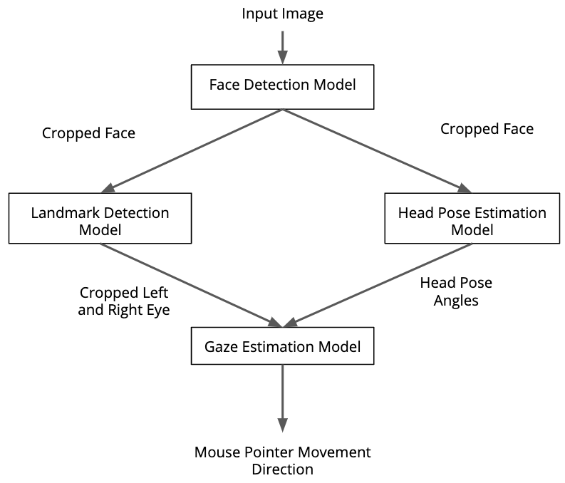

# Computer Pointer Controller

In this project, I am using a **Gaze Detection Model** to control the mouse pointer of our computer. I am using the Gaze Estimation model to estimate the gaze of the user's eyes and change the mouse pointer position accordingly. This project demonstrates my ability to run multiple models in the same machine and coordinate the flow of data between those models.  

Gaze Detection model requires three inputs.
-  Cropped Left Eye
-  Cropped Right Eye
-  Head Pose.  

To get values of these inputs I am using Three models:  
-  Face Detection Model
-  Face Landmark Model
-  Head Pose Estimation  

I am passing data in all models. and using their output after preprocessing as input to other models and finally Estimates Gaze of user and Move Mouse Pointer Accordingly.

### Pipeline  
  
This diagram shows us how different model interact with each other

## Project Set Up and Installation
Hardware and Software Requirement, Dependencies, How to install them and How to Download model files.
### Project files Tree
```s
├── README.md
├── bin
│   ├── demo.mp4
│   └── face.png
├── requirements.txt
└── src
    ├── face_detector.py
    ├── gaze_estimator.py
    ├── head_pose_estimator.py
    ├── input_feeder.py
    ├── landmark_detector.py
    ├── main.py
    └── mouse_controller.py

2 directories, 11 files
```
### Requirements

#### Hardware

* 6th to 10th generation Intel® Core™ processor with Iris® Pro graphics or Intel® HD Graphics.
* OR use of Intel® Neural Compute Stick 2 (NCS2)

#### Software

*   Intel® Distribution of OpenVINO™ toolkit 2020.4 release
*   Python Version 3.5 or 3.6

#### Python Dependencies

Python dependencies are defined in `requirement.txt` file on home directory.  

### Installations

#### OpenVino Toolkit Version 2020.4
To Install the OpenVino Toolkit Version 2020.4 refer to this [OpenVino Toolkit Installation Guide](https://docs.openvinotoolkit.org/2020.4/openvino_docs_install_guides_installing_openvino_linux.html#install-openvino)  
  
#### Python 3.5 or 3.6

> Note: This version is only supported by Python 3.5 or 3.6.  

To Install Python 3.5 or 3.6 refer to this [Python Installation Guide](https://realpython.com/installing-python/)

#### Virtual Environment
Installing and activating virtual environment will isolate your packages from the whole system.   

To Install **Python 3.5 or 3.6 Virtual Environment** refer to this [Virtual Environment Installation Guide](https://thepythonguru.com/python-virtualenv-guide/)  

#### Python dependencies
To install them first activate your virtual environment and then go to project home directory and run below command  
```
pip3 install -r requirements.txt
```  

### Download OpenVino models.
For this project we need these models.  

1.  [face-detection-adas-binary-0001](https://docs.openvinotoolkit.org/2020.4/omz_models_intel_face_detection_adas_binary_0001_description_face_detection_adas_binary_0001.html).  
2.  [landmarks-regression-retail-0009](https://docs.openvinotoolkit.org/2020.4/omz_models_intel_landmarks_regression_retail_0009_description_landmarks_regression_retail_0009.html)  
3.  [head-pose-estimation-adas-0001](https://docs.openvinotoolkit.org/2020.4/omz_models_intel_head_pose_estimation_adas_0001_description_head_pose_estimation_adas_0001.html)
4.  [gaze-estimation-adas-0002](https://docs.openvinotoolkit.org/2020.4/omz_models_intel_gaze_estimation_adas_0002_description_gaze_estimation_adas_0002.html)  


### Download the model
Below command is used to download models files.  
first install pre requisites:  
```
python3 -mpip install --user -r /[openvino/installation/directory]/openvino/deployment_tools/tools/model_downloader/requirements.in
```  
  
Then download the models files with below command.  
```
python3 /[openvino/installation/directory]/openvino/deployment_tools/tools/model_downloader/downloader.py --name [model_name]  --output_dir my/download/directory --precisions [precision]
```  
Download all models from the above models list
In above command replace [model_name] with the name of the model from above models list.  
In the above command replace [precision] with the model precision you want to use.
-  For running model on CPU use precisions as FP32.
-  For running model on MYRIAD VPU or IGPU use precisions as FP16.
## Demo
### Run the code

Open a new terminal to run the code. 

#### Setup the environment
Activate your Virtual Environment.  

You must configure the virtual environment to use the Intel® Distribution of OpenVINO™ toolkit one time per session by running the following command:
```
source /opt/intel/openvino/bin/setupvars.sh -pyver 3.5
```

You should also be able to run the application with Python 3.6, although newer versions of Python will not work with the app.
#### Running the program

Though by default application runs on CPU, this can also be explicitly specified by ```-d CPU``` command-line argument:  

run below command to run application.
```
python src/main.py -i bin/demo.mp4 -ftm your-face-detection-model.xml -ldm your-landmarks-detection-model.xml -hem your-head-pose-model.xml -gem your-gaze-estimation-model.xml -d CPU -pt 0.6
```

To Understand all command line argument see below help.
> To change the device you want your model to run see description of `-d` argument below. 

```
usage: main.py [-h] -ftm FACE_DET_M -ldm LMAR_DET_M -hem H_POSE_M -gem G_EST_M
               -i INPUT [-l CPU_EXTENSION] [-d DEVICE] [-pt PROB_THRESHOLD]

optional arguments:
  -h, --help            show this help message and exit
  -ftm FACE_DET_M, --face_det_m FACE_DET_M
                        Path to an xml file of Face Detection Model.
  -ldm LMAR_DET_M, --lmar_det_m LMAR_DET_M
                        Path to an xml file of Landmark Detection model
  -hem H_POSE_M, --h_pose_m H_POSE_M
                        Path to an xml file of Head Pose Estimation model.
  -gem G_EST_M, --g_est_m G_EST_M
                        Path to an xml file of Gaze Estimation Model.


  -i INPUT, --input INPUT
                        Path to image or video file
  -l CPU_EXTENSION, --cpu_extension CPU_EXTENSION
                        MKLDNN (CPU)-targeted custom layers.Absolute path to a
                        shared library with thekernels impl.

  -d DEVICE, --device DEVICE
                        Specify the target device to infer on: CPU, GPU, FPGA
                        or MYRIAD is acceptable. Sample will look for a
                        suitable plugin for device specified (CPU by default)
  -pt PROB_THRESHOLD, --prob_threshold PROB_THRESHOLD
                        Probability threshold for face detections filtering(0.5 by
                        default)
```

##### Using a camera stream instead of a video file

To get the input video from the camera, use the `-i CAM` command-line argument.  

##### Running on the Intel® Neural Compute Stick

To run on the Intel® Neural Compute Stick, use the ```-d MYRIAD``` command-line argument.
> computation on MYRIAD Intel NCS requires model of precision `FP16`. for downloading model with that precision refere to model downloading section

##### Running on the Integrated Graphical Processing Unit (IGPU)

To run on the IGPU, use the ```-d GPU``` command-line argument.
> computation on IGPU requires model of precision `FP16`. for downloading model with that precision refere to model downloading section
## Documentation
### Project files Tree
```s
├── README.md
├── bin
│   ├── demo.mp4
│   └── face.png
├── requirements.txt
└── src
    ├── face_detector.py
    ├── gaze_estimator.py
    ├── head_pose_estimator.py
    ├── input_feeder.py
    ├── landmark_detector.py
    ├── main.py
    └── mouse_controller.py

2 directories, 11 files
```
*  In above Tree `bin` folder contain all inputs files and helper images 
*  `requirements.txt` file indicates all python libraries dependencies for this project.
*  `src` has all python script `main.py` is the main script and all others are helper functions you can read comments in these files to know what do these files do.  
### Commad Line Arguments
You can read help about all command lines argument by running below command 
```
python src/main.py --help
```
This will show output file like that.

```
usage: main.py [-h] -ftm FACE_DET_M -ldm LMAR_DET_M -hem H_POSE_M -gem G_EST_M
               -i INPUT [-l CPU_EXTENSION] [-d DEVICE] [-pt PROB_THRESHOLD]

optional arguments:
  -h, --help            show this help message and exit
  -ftm FACE_DET_M, --face_det_m FACE_DET_M
                        Path to an xml file of Face Detection Model.
  -ldm LMAR_DET_M, --lmar_det_m LMAR_DET_M
                        Path to an xml file of Landmark Detection model
  -hem H_POSE_M, --h_pose_m H_POSE_M
                        Path to an xml file of Head Pose Estimation model.
  -gem G_EST_M, --g_est_m G_EST_M
                        Path to an xml file of Gaze Estimation Model.


  -i INPUT, --input INPUT
                        Path to image or video file
  -l CPU_EXTENSION, --cpu_extension CPU_EXTENSION
                        MKLDNN (CPU)-targeted custom layers.Absolute path to a
                        shared library with thekernels impl.

  -d DEVICE, --device DEVICE
                        Specify the target device to infer on: CPU, GPU, FPGA
                        or MYRIAD is acceptable. Sample will look for a
                        suitable plugin for device specified (CPU by default)
  -pt PROB_THRESHOLD, --prob_threshold PROB_THRESHOLD
                        Probability threshold for face detections filtering(0.5 by
                        default)
```

#### Description
1.  `-h` will show you help message about arguments
2.  `-ftm` is the Path to the xml file of Face Detection Model.
3.  `-ldm` is Path to an xml file of Landmark Detection model.
4.  `-hem` Path to an xml file of Head Pose Estimation model.
5.  `-gem` Path to an xml file of Gaze Estimation Model.
6.  `-i` Path to image or video file or 'cam' for using attached camera
7.  `-l` OPTIONAL CPU_EXTENSION MKLDNN (CPU)-targeted custom layers.Absolute path to a shared library with thekernels impl.
8.  `-d` Specify the target device to infer on: CPU, GPU, FPGA
                        or MYRIAD is acceptable. Sample will look for a
                        suitable plugin for device specified (CPU by default)
9.  `-pt` Probability threshold for face detections filtering(0.5 by
                        default)
## Benchmarks

### Model Loading Time

  
  


**Difference Between Sync and Async Model Loading Time**:  

Model Loading for both Sync inference and Async Inference are almost same because Model Loading Time Depends on Model and Device Type not The inference Type  

**Model Loading for models of different precision level**:  

Model Loading for `FP16` and `FP32`  precision are totally same but in case of `FP32-INT8` it increases a lot. Because both datatypes are in same model so that is why it takes a lot more time to Load

### Inference Time

  
  


**Difference Between Sync and Async Inference Time**:  

There is a little difference between Inference Time of both types of inference. The inference time for Asynchronouse is less then Synchronous Inference.  Because Async inference does not halt other processes of the application and Sync halt the other application while doing inference.

**Inference Time for models of different precision level**:  
The model of FP32 takes more inference time than the other types of models i.e. FP16. So inferenct time for FP16 is faster than that of FP32. because the FP16 Has low precision so some computations can be fast

### Inference Frame per second

  
  


**Difference Between Sync and Async Inference Frame per second**:  
The rate of doing Async inference of frames per second is higher than Sync inference so that is why we widely use Async because it does not halt the application and it do inference fast then Sync inference.

**Inference Frame per second for models of different precision level**:  
The frame per second of FP16 model is greatest then all the other models precision type just like we have above situation for Infernce Time.

## Results

**The Model Loading time.**  

As we can see in above graphs the model Loading time is lowest for low precision models because the memory consumed by low percision models is less than higher precision models.  
And more precision means the values of weight and biases have more bit rate and consume more memory and loading those model values from storage is going to take more time.  

**The inference time**

As seen on above graphs FP16 models take the most less time than other models types so They are very fast models. Because higher the number of precision will mean that the values of weight and biases in the model has more bitrate and to do computation on high precision mathematical operations is very expensive in time and memory.

### Edge Cases
There will be certain situations that will break your inference flow. For instance, lighting changes or multiple people in the frame. Explain some of the edge cases you encountered in your project and how you solved them to make your project more robust. 


Lighting, model accuracy, and camera focal length/image size have different effects on a
deployed edge model. The potential effects of each of these are as follows...

To perform this application completely and accurately some factors should be kept in mind.  


*  **The number of Faces in front of camera**   

There can be case when there are more than one face in front of the camera it can cause some issues  
**My Solution**  
In the postprocesing of face detection model output I only filter those faces which has confidence more than specified threshold.  
If more than one face has more confidence then I take only one face with highest confidence.  

*  **Light**  

Their should be enough light in the environement infront of camera that user face can be seen accurately and so model can detect them.  
We can do some image preprocessing to increase light with artificial computer methods.

*  **image size**  

There can be the case when a face is looking to small that model can not detect the face.
According to this specific model `face-detection-adas-binary-0001` the minimum dimension of the image feeded in should be `672 * 384`. 
As in preprocessing step we can resize the image but there are some limits.  
The dimensions of image should not be so high that we loose some information during resizing it. and it should not decrease from `672 * 384` because it will blur the image and model will not be able to detect face accurately.